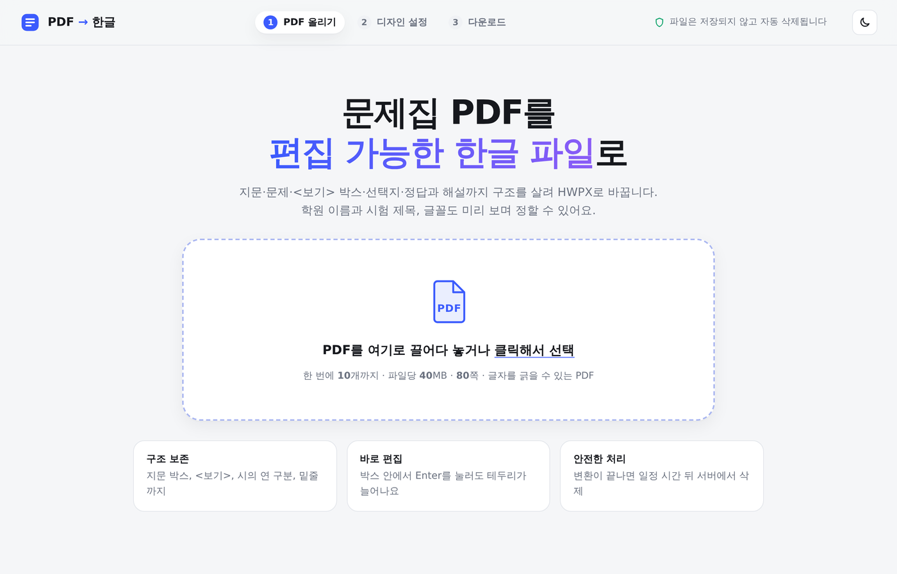
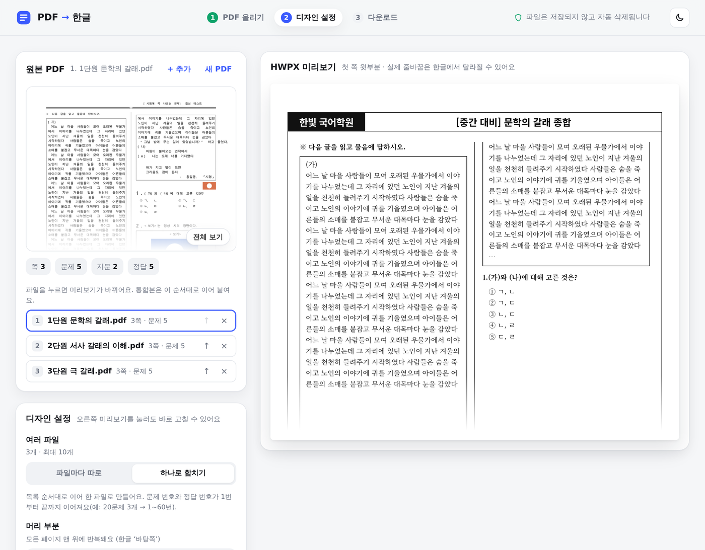
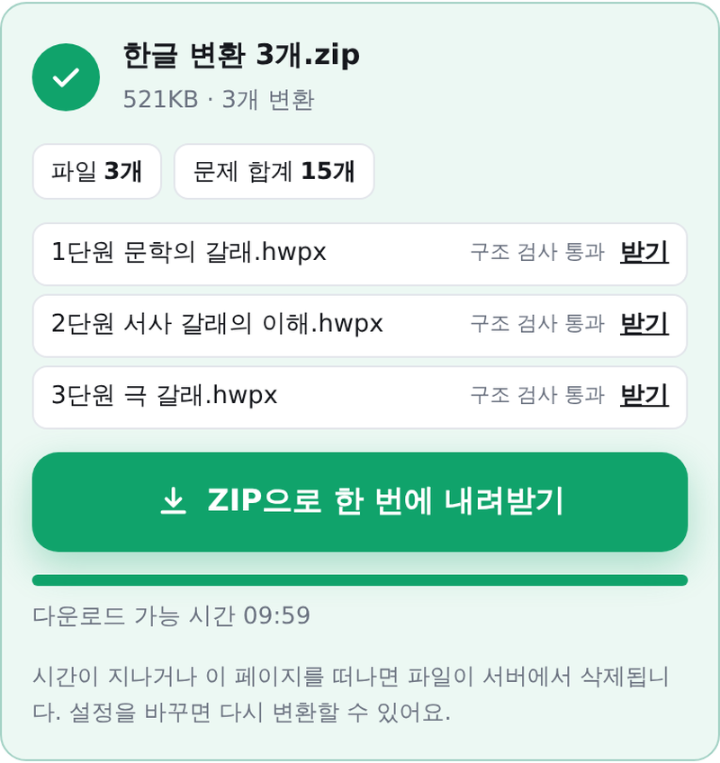
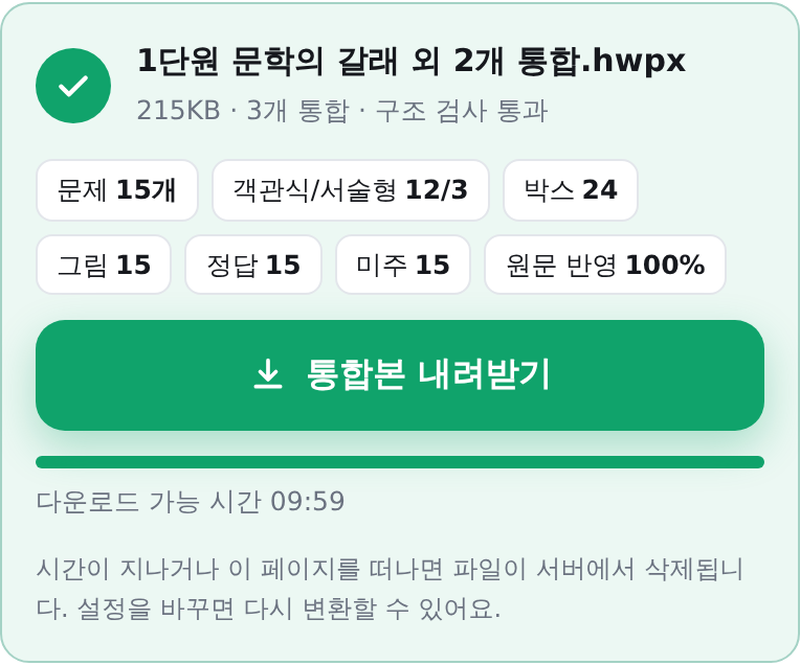
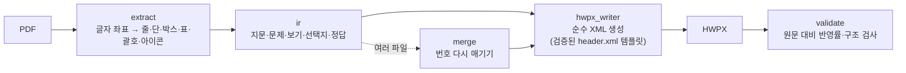
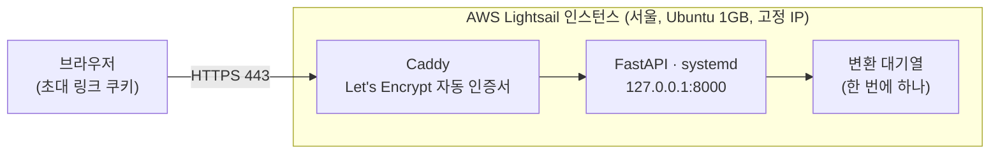

# PDF → 한글(HWPX) 변환기

[](https://github.com/Altlog214608/pdf-to-hwpx/actions/workflows/tests.yml)

국어 문제집 PDF(2단 편집, 지문·문제·`<보기>` 박스·선택지·정답과 해설)를 **편집 가능한 한글 파일(HWPX)** 로 바꾸는
변환기와 전용 웹사이트입니다. 한글(Hancom) 프로그램 없이 순수 Python으로 HWPX를 만들기 때문에 Linux 서버에서도 동작하고,
AWS Lightsail에 배포해 초대받은 사람만 쓰도록 운영하고 있습니다.

> 현직 국어 강사가 문제집 PDF를 학원 시험지 양식의 한글 파일로 일일이 다시 옮겨 치던 일을 줄이려고 만들었습니다.
> 실제 사용자의 피드백(자동 문제 번호, 여러 파일 통합본 등)을 받아 반영하며 개선하고 있습니다.



## 주요 기능

| 기능 | 설명 |
|---|---|
| 구조 보존 변환 | 지문 박스, `<보기>`·`<조건>` 박스, 시의 연 구분, 밑줄, 원문자 선택지(①~⑤), 그림, 선으로 그린 표(병합 칸·배경색), `[A]` 묶음 괄호, 빈칸 네모 |
| 정답·해설 | 문서 끝에 모으기 또는 **각 문제와 미주로 연결**(수작업 시험지 방식) |
| 자동 문제 번호 | 문제 번호를 한글 **문단 번호**로 넣어, 문제를 더 쓰거나 다른 파일을 붙여 넣으면 번호가 자동으로 이어짐 |
| 여러 파일 | 한 번에 최대 10개. **파일마다 따로**(대기열로 하나씩 변환 → ZIP/개별 다운로드) 또는 **하나로 합치기**(20문제 3개 → 1~60번, 정답 번호도 맞춤) |
| 시험지 머리 | 학원 이름/로고, 시험 제목(색), 페이지 테두리를 한글 **바탕쪽**으로 생성. 본문 글꼴·크기 선택 |
| 미리보기 | 원본 첫 쪽과 HWPX 첫 쪽 윗부분을 나란히 보며 설정, PDF 머리글에서 제목 후보 추천 |
| 검증 | 변환 결과를 다시 읽어 원문 글자 반영률, 박스 수, 문제 순서, 표 격자 무결성 등을 자동 검사 |
| 저작권 보호 | 업로드 파일은 작업 폴더에만 두고 30분 TTL·페이지 이탈 시 삭제. 다운로드 링크는 10분. 변환에 실패한 파일만 고치기 위해 14일 보관(화면에 안내) |
| 이용 기록 | 관리자 전용 `/admin`: 사람별·날짜별 변환 횟수·쪽수·문제 수, 최근 기록, CSV (파일 내용·이름은 기록하지 않음) |
| 문제 생긴 파일 | 결과가 '문제 있음'이거나 오류가 난 PDF만 결과·원인·오류 위치와 함께 자동 보관 → 관리자가 내려받아 실제 파일로 원인을 고치고 머지 전에 다시 확인 |

| 디자인 설정 + 미리보기 | 결과(따로 변환 / 통합본) |
|---|---|
|  |   |

## 동작 방식



- **extract**: PyMuPDF로 글자 좌표를 읽어 줄을 다시 만들고 2단을 나눕니다. 박스·표·`[A]` 괄호는 그림 명령의 가로/세로 선분을
  모아 기하적으로 복원합니다(표는 선분 교차점을 union-find로 묶어 격자와 병합 칸을 찾음). 원문자 선택지가 글자가 아닌
  이미지인 PDF는 이미지 해시와 선택지 순서 투표로 ①~⑤를 판별합니다.
- **ir**: 큰 글씨·기대 번호로 문제 머리를 찾고, 줄 오른쪽 끝 위치로 산문/시를 구분해 문단을 나눕니다.
- **hwpx_writer**: 한글에서 실제로 열어 검증한 `header.xml`의 스타일 id를 재사용하고, 변형은 복제해 새 id로만 추가합니다.
  후처리 패치 없이 IR에서 한 번에 생성합니다.
- **validate**: 만든 HWPX를 다시 풀어 원문 PDF와 6-gram 반영률을 비교하고, 누락 줄과 근본 원인을 한 줄씩 보고합니다.
- 특정 PDF 하나에 맞춘 하드코딩 대신 좌표 규칙으로 일반화하고, 그 특징을 넣은 **합성 PDF 테스트**로 회귀를 막습니다.

### 웹과 운영



- **FastAPI** 백엔드와 바닐라 JS 프런트엔드(드래그 앤 드롭, 어두운 화면, 반응형).
- 접속 제한: 사람마다 다른 초대 링크(`/join/키`) → 180일 HttpOnly 쿠키. 키를 지우고 다시 배포하면 그 사람만 끊김.
- 배포: `tools/deploy_lightsail.ps1`(Windows PowerShell 한 줄)이 서버·고정 IP·방화벽 생성, 코드 업로드, 설치(`tools/server/setup.sh`),
  HTTPS 확인, 초대 링크 출력까지 처리. 변환은 서버 전체에서 하나씩 처리해 1GB 서버에서도 메모리가 넘치지 않음.

## 기술 스택

Python 3.10+ · PyMuPDF · FastAPI/Uvicorn · HTML/CSS/JavaScript · pytest · AWS Lightsail · Caddy · systemd · Docker(선택) · PowerShell

## 실행

```powershell
# 변환기만 (PDF 옆에 같은이름.hwpx)
pip install -r requirements.txt; python .\v0_5_pdf_to_hwpx.py .\문제집.pdf
# 여러 파일을 번호 이어서 하나로
python .\v0_5_pdf_to_hwpx.py .\1단원.pdf .\2단원.pdf --merge .\통합본.hwpx

# 웹사이트 (http://127.0.0.1:8000)
pip install -r requirements.txt -r webapp\requirements.txt; python .\webapp\server.py
```

- Windows에서는 압축을 푼 폴더의 `실행하기.bat`을 더블클릭해도 됩니다(Python이 없으면 자동 설치).
- AWS 배포·환경 변수·API는 [docs/WEB.md](docs/WEB.md), 버전별 변경과 설계 판단은 [docs/V0_5.md](docs/V0_5.md).

## 테스트

```powershell
python -m pytest tests -q
```

합성 PDF(`tests/synth_pdf.py`)로 박스·표·괄호·선택지·정답·통합본·자동 번호를 검사하고, 웹 API(업로드 → 변환 → 다운로드 → 만료/삭제,
초대 링크 접속 제한)와 Windows 실행 파일 인코딩까지 확인합니다. 실제 문제집 PDF는 저작권 때문에 저장소에 넣지 않으며,
가지고 있으면 `PDF2HWPX_SAMPLES=폴더`로 회귀 테스트를 돌릴 수 있습니다.

## 구조

```
pdf2hwpx/            변환기 (extract → ir → hwpx_writer → validate, merge, style, masterpage)
webapp/              웹 서버(FastAPI)와 화면(static/)
tests/               합성 PDF 테스트, 웹 API 테스트, 실제 PDF 회귀 테스트
tools/               실행하기.bat용 스크립트, AWS 배포 스크립트, 서버 설치 스크립트
docs/                변경 기록(V0_5.md), 웹/배포(WEB.md), 화면 캡처, 이전 버전 분석(history/)
```

## 개발 방식

- 기간: 2026년 9월 ~ 현재(운영 중), 1인 개발.
- 요구사항 정의, 설계 방향, 실사용 피드백 수집과 한글에서의 결과 검증, AWS 배포·운영은 직접 하고,
  코드 구현은 AI 코딩 도구(Claude Code)와 협업했습니다. 커밋 기록에 AI 공동 작성이 표시되어 있습니다.
- 단계 경계, 좌표 기반 일반화(특정 PDF 하드코딩 금지), 합성 PDF 회귀 테스트, 업로드 파일 비보관 같은 원칙은
  [CLAUDE.md](CLAUDE.md)에 프로젝트 규칙으로 정해 두고 그 기준으로 결과물을 검토했습니다.

## 만들며 배운 것

- **다시 설계하기**: 처음 버전(v0.1~v0.4)은 3만 줄짜리 파일 하나에서 한글 COM 자동화로 문서를 만든 뒤 버전마다 후처리를 덧붙이는
  구조였고, 박스 하나가 실패하면 문서 전체 테두리가 사라지는 연쇄 오류가 났습니다. 단계 경계(extract → IR → writer → validate)를
  나누고 HWPX를 순수 XML로 한 번에 만들도록 다시 작성해 코드는 약 3,700줄, 1개 문서 변환은 1초 안팎으로 줄었습니다.
- **측정 가능한 검증**: "XML 속성이 있다"만 보던 검사를 원문 대비 글자 반영률로 바꾸자, 띄어쓰기 소실·연 구분 소실처럼
  눈으로만 찾던 결함이 수치로 드러났습니다.
- **실사용 피드백**: 실제 사용자가 한글에서 열어 본 피드백(표 글자 중복, 선택지 격자 열 폭, 문제 번호 자동 매기기)을
  좌표 규칙과 합성 테스트로 일반화해 반영했습니다.
- **작은 서비스 운영**: 새 AWS 계정의 Lightsail 컨테이너 서비스 한도(0) 때문에 인스턴스 + Caddy 자동 HTTPS로 방향을 바꾸고,
  배포·삭제를 스크립트 한 줄로 만들었습니다.

## 한계

- 글자 레이어가 없는 스캔본 PDF는 변환하지 않습니다(업로드 단계에서 안내).
- 지문 안내 `[21~23]`은 글자라서 한글에서 문제를 지우거나 끼워 넣으면 범위는 손으로 고쳐야 합니다.
- 줄바꿈 위치는 한글의 글꼴·조판에 따라 원본과 다를 수 있습니다.
